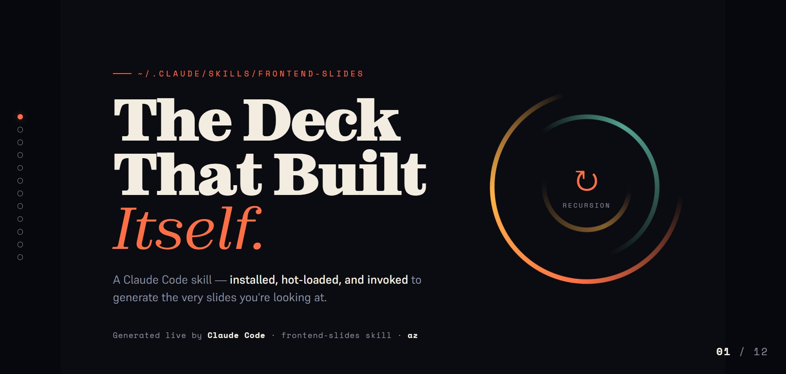

# The Deck That Built Itself

> A self-contained, zero-dependency HTML slide deck about installing an AI skill,
> hot-loading it, and invoking it — to generate the very slides you're looking at.

### ▶ [**View the live deck**](https://az9713.github.io/the-deck-that-built-itself/) &nbsp;·&nbsp; [open the file](./the-deck-that-built-itself.html)

[](https://az9713.github.io/the-deck-that-built-itself/)

<sub>↑ Click the poster to launch the live, interactive deck (arrow keys / swipe to navigate). GitHub can't run HTML inline, so it's hosted on GitHub Pages.</sub>

---

> ### ⭐ Built with **[frontend-slides](https://github.com/zarazhangrui/frontend-slides)** by [Zara Zhang](https://github.com/zarazhangrui)
> The open-source Claude Code skill (**22k+ stars on GitHub**) that turns a coding agent into a
> front-end designer: it asks for context, shows you cover directions, and generates a polished,
> animation-rich HTML deck — no PowerPoint, no design skills required. **This entire project is
> that skill, turned back on its own story.**

---

## 🌀 1. It's recursive

This project eats its own tail.

The deck (`the-deck-that-built-itself.html`) is a 12-slide presentation **about the process of making it**. Slide 4 shows the `git clone` that installed the skill. Slide 5 shows the hot-reload. Slide 6 shows the prompt that kicked the whole thing off. Slide 10 diagrams the loop explicitly:

```
        The Skill ──────────▶ This Deck
            ▲                     │
            └──── …about the Skill ┘
```

The output **describes the process that produced it**. The deck's own visual style — the one labeled *"chosen"* on the show-don't-tell slide — is the style the deck is actually built in. Form is the content.

## 🤖 2. It's autonomous

No human pushed boxes around. The entire artifact was produced by **Claude Code** in a single unattended run:

1. Claude Code read a transcript of the source video (URL included below).
2. It cloned the **frontend-slides** skill from GitHub into personal scope.
3. It hot-loaded the skill **without restarting the session** (a folder rescan — the same thing `/reload-plugins` triggers).
4. It invoked the skill, made every design decision itself (purpose, length, density, and a custom visual direction), generated the deck, then rendered and screenshotted all 12 slides to verify zero overflow and fix its own mistakes.

The loop was closed with a single instruction:

```
/goal install zara frontend-slide skill in personal scope. invoke the skill to
create a html slide deck on this very process: downloading the skill and invoking
it to create a slide deck of this process. yes. it is very meta. use
"/reload-plugins" to hot-load the new skills so i dont need to exit claude code.
the whole process should be autonomous. do not stop until a jaw-dropping,
awe-inspiring html slide deck is created.
```

That one line was the only input. Everything else — the research, the install, the design, the QA — Claude Code did on its own.

---

## What's in here

| Path | What it is |
| --- | --- |
| [`the-deck-that-built-itself.html`](./the-deck-that-built-itself.html) | The deck. One self-contained file. Open it in any browser. |
| [`.claude/skills/frontend-slides/`](./.claude/skills/frontend-slides/) | The skill, installed at **project scope** so anyone cloning this repo can regenerate or extend the deck. |
| `README.md` | You're reading it. |

## The deck itself

- **12 slides**, fixed 16:9 stage (1920×1080) scaled to any viewport — holds up on phones too
- **Zero dependencies** — all CSS and JS inline, no build step, no npm
- **Editorial-terminal design** — Zodiak serif + Space Mono, warm coral signal on cold ink, animated recursion rings, syntax-colored terminal cards
- **Interactive** — keyboard / wheel / swipe navigation, progress bar, hover-label nav dots, laser-pointer cursor, a click-to-reveal easter egg, and live inline text editing (press **E**, `Ctrl+S` to save)

## Run it

```bash
# clone, then just open the file — no install, no server needed
open the-deck-that-built-itself.html      # macOS
start the-deck-that-built-itself.html     # Windows
```

Navigate with **arrow keys**, **space**, **mouse wheel**, or **swipe**. Press **E** to edit any text in place.

---

## Credits & source

The technique — vibe-coding beautiful HTML slides with an AI agent instead of fighting PowerPoint — comes from the video:

**"Stop making PowerPoints: how to vibe code beautiful HTML slides with AI (22k+ stars on GitHub)"**
📺 https://www.youtube.com/watch?v=372Iksaz8b0

The deck is generated by **frontend-slides**, the open-source Claude Code skill created by **Zara Zhang** — one of the most popular slide skills out there at **22k+ stars**:
🔗 https://github.com/zarazhangrui/frontend-slides

A copy of the skill is vendored in this repo at [`.claude/skills/frontend-slides/`](./.claude/skills/frontend-slides/) (project scope) so the deck is fully reproducible. All credit for the skill itself goes to Zara Zhang.

This repository is a demonstration of that skill turned back on its own story — built start to finish by Claude Code from a single `/goal` prompt.
